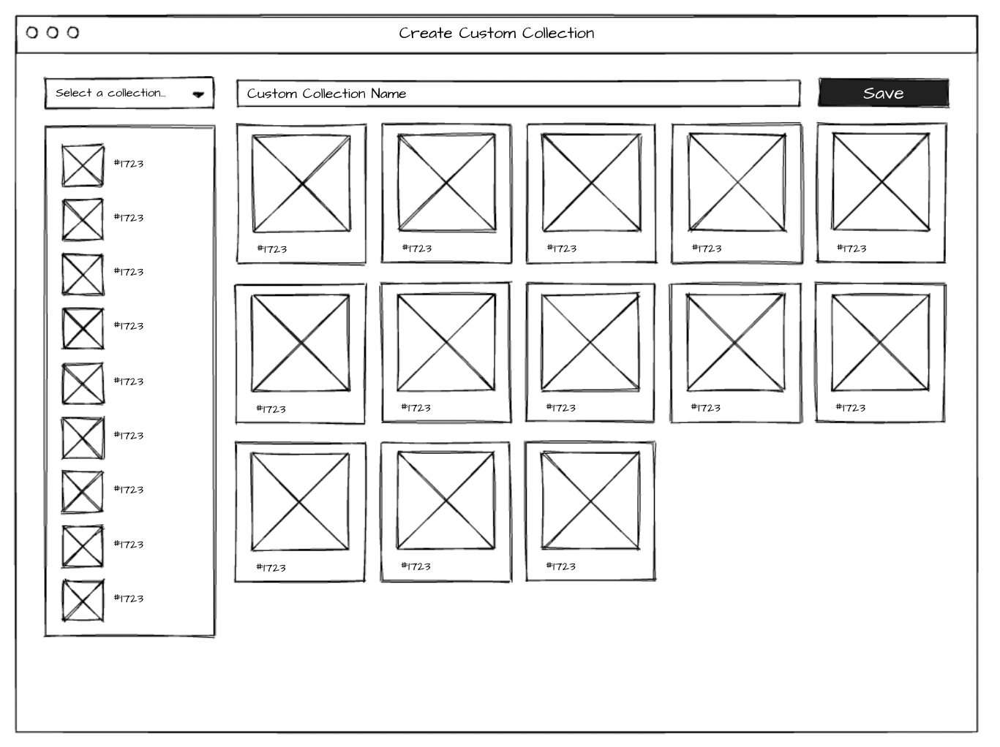
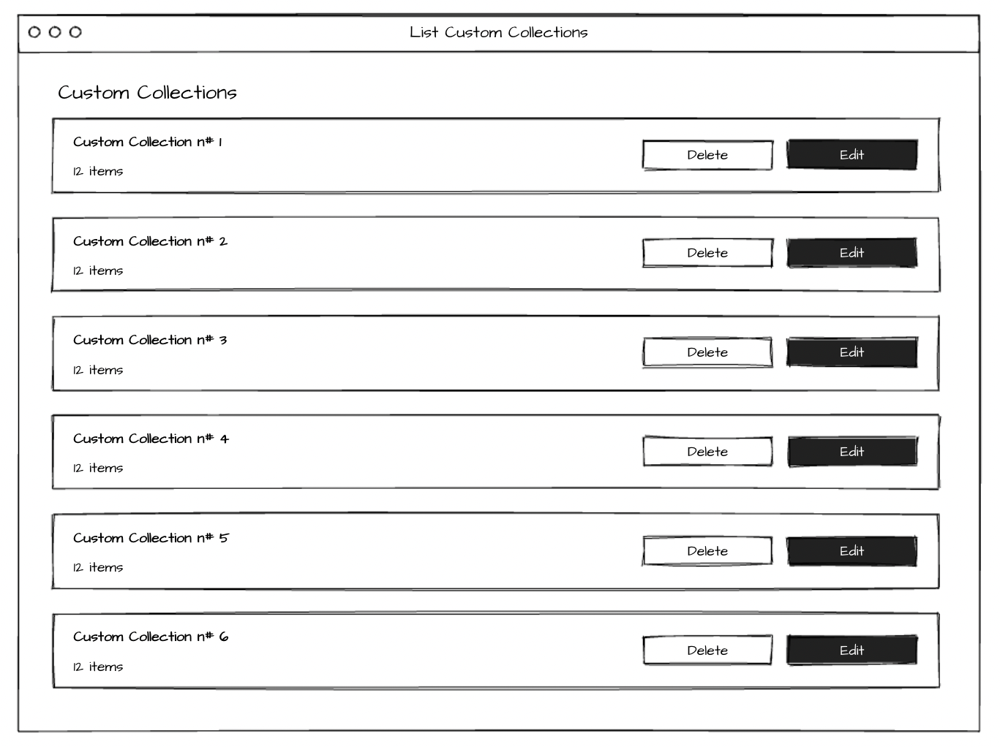

# Frontend take-home: Custom Collections

In the NFT world tokens are organized in Collections. Most of the times, each collection groups thousands of NFTs making it a bit hard to keep track of what's happening with the specific tokens we're interested in.

For this take-home, we want you to build a little piece of the platform that will help users group tokens into one Custom Collection that can be followed and monitored. We want you to build a web app that lists all NFT collections available in the [Reservoir API](https://docs.reservoir.tools/reference), and will let the user select which particular tokens will be included in their own Custom Collection.

On the left side the user can select a collection from the dropdown. Then the token list below the dropdown will list the available NFTs in that collection.

The user should be able to drag & drop items into the right side section to add this item to the Custom Collection. Items added to the Custom Collection could be removed (this could be performed by clicking a call-to-action in each card).

A Custom Collection should have a non-empty name and we should give the user the ability to persist the Custom Collection.

Later the user should be able to see the list of created Custon Collections in the app.

Note that the wireframes in this document are just for reference. More UI elements will be required to be able to implement all features.

## Notes

- We only require the app to be built using React.
- You're free to use any other library.
- Some persistency layer is required. You're allowed to use any tecnology/architecture/pattern.

## Deliverable:

- Please fork this repo and push your solution.
- Runnable code in a local environment.
- Proper documentation, explaining design desitions and providing instruction for the setup of the local environment.
- Appropriate testing.

## Evaluation Criteria:

We should be able to execute your solution without much hassle, and the app should be intuitive to use. We will evaluate your code based on clarity, performance, and maintainability. Make sure to include relevant tests and documentation.

Let us know if you have any questions. Happy coding!

# Solution

## Stack

The solution uses React as requested, simplified via NextJS which in turn is bootstrapped using [CreateT3App](https://create.t3.gg), which provides out-of-the-box support for Typescript and TailwindCSS for type-safe code and consistent UI.

## Persistence

Persistence is achieved using local storage (simplified it using a React hook from the use-persisted-state package). This means no database is needed and no backend is needed to acccess said db

## Running locally

To run:

- Add .env with the correct NEXT_PUBLIC_NFT_API variable
- `npm i`
- `npm run dev`

To test:

- Make sure webapp is running in localhost:3000 by running `npm run dev`
- `npm run cypress`
- Run the spec.cy.ts test
